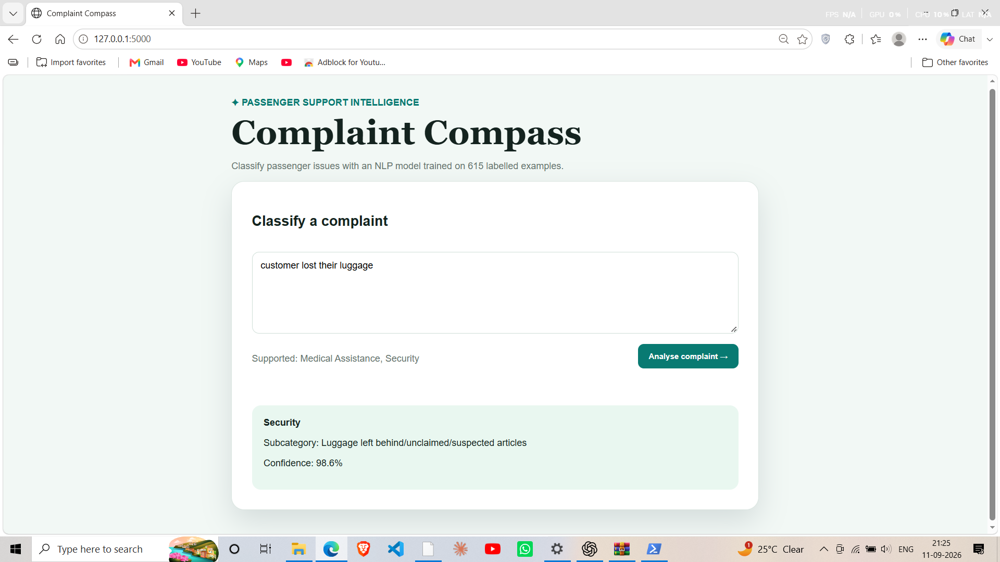
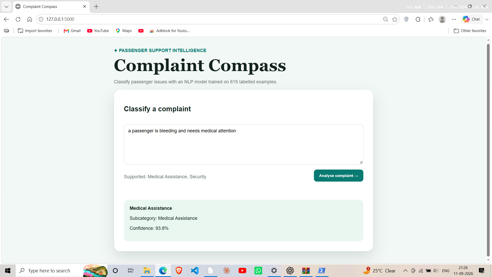

# Complaint Compass

> A web-based NLP classifier that routes passenger complaints to the most relevant category and subcategory.

Complaint Compass turns free-text passenger issues into structured support signals. It uses a TF-IDF text representation and Multinomial Naive Bayes classifiers, then returns a predicted category, subcategory, and confidence score through a Flask web interface and JSON API.

## Live project preview

| Security / luggage example | Medical-assistance example |
| --- | --- |
|  |  |

## Features

- Classifies natural-language passenger complaints in seconds.
- Predicts both a broad category and a more specific subcategory.
- Shows a confidence score for the selected category.
- Offers a clean, responsive Flask interface for hands-on testing.
- Exposes a JSON endpoint for integration with another frontend or support workflow.
- Uses reusable preprocessing and cached model loading, so the model is trained once per app session.

## Tech stack

| Area | Tools |
| --- | --- |
| Language | Python |
| NLP / machine learning | scikit-learn, TF-IDF, Multinomial Naive Bayes |
| Data handling | pandas |
| Web application / API | Flask |
| Version control | Git and GitHub |

## How it works

```text
Complaint text
      |
      v
Text normalization
      |
      v
TF-IDF vectorizer (unigrams + bigrams)
      |
      v
Naive Bayes category classifier
      |
      v
Category-specific subcategory classifier
      |
      v
Category + subcategory + confidence score
```

The app first determines the most likely category. If that category has multiple available subcategories, it applies a second classifier trained only on examples from that category.

## Getting started

### 1. Clone the repository

```bash
git clone https://github.com/Yash555558/complaint-classifier.git
cd complaint-classifier
```

### 2. Create and activate a virtual environment

**Windows PowerShell**

```powershell
python -m venv .venv
.\.venv\Scripts\Activate.ps1
```

If PowerShell blocks activation, run the following command for the current terminal only, then activate again:

```powershell
Set-ExecutionPolicy -Scope Process -ExecutionPolicy Bypass
```

### 3. Install dependencies

```powershell
python -m pip install -r requirements.txt
```

### 4. Start the web application

```powershell
python app.py
```

Open [http://127.0.0.1:5000](http://127.0.0.1:5000) in a browser.

## API usage

Send a `POST` request to `/api/classify` with a complaint payload:

```json
{
  "complaint": "A passenger fainted near gate 12 and needs immediate help."
}
```

Example response:

```json
{
  "category": "Medical Assistance",
  "subcategory": "Medical Assistance",
  "confidence": 95.1
}
```

## Project structure

```text
complaint-classifier/
├── app.py             # Flask application and prediction API
├── nlp.py             # Original command-line classifier and evaluation script
├── complaints.csv     # Labelled complaint dataset
├── requirements.txt   # Python dependencies
├── assets/            # README screenshots
└── README.md
```

## Dataset scope and limitations

The included dataset contains 615 labelled examples and currently supports only the categories represented in `complaints.csv` (including Medical Assistance and Security). The model cannot reliably identify a category that is absent from the training data—for example, it should not be treated as a general-purpose luggage, refund, or flight-delay classifier.

The confidence score is a model probability, not a guarantee of correctness. Real deployment would require a larger, balanced dataset, evaluation on unseen operational data, monitoring, and human review for high-impact cases.

## Future improvements

- Add labelled examples for baggage, cancellations, boarding, refunds, and delays.
- Compare baseline Naive Bayes against logistic regression and transformer-based models.
- Add automated tests, model-version tracking, and a Docker deployment configuration.
- Store feedback to support continuous model improvement.
- Add authentication and role-based workflows for support teams.

## Author

Built by [Yash Kumar](https://github.com/Yash555558).
